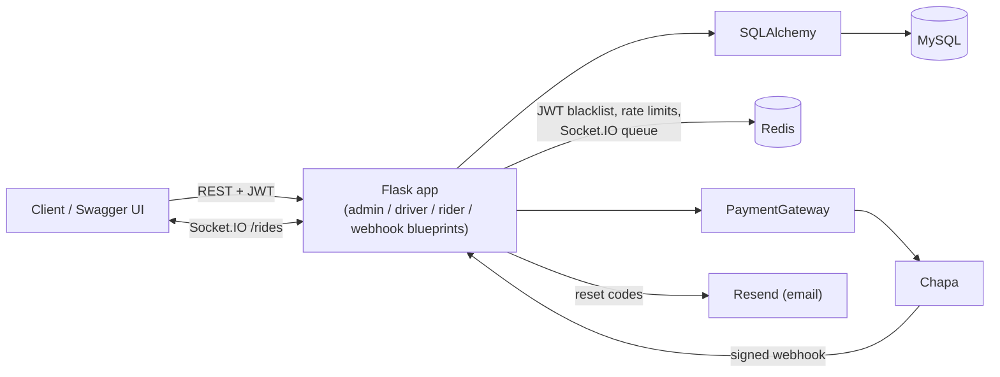

# Wego Ride

[](https://github.com/bakiizese/Wego_ride_backend/actions/workflows/ci.yml)
[](LICENSE)


Backend for a scheduled ride-sharing service (shuttle / carpool style). An admin schedules trips, riders book seats on them, and drivers run the route. Built with Flask, SQLAlchemy, MySQL and Redis.

**Live:** https://wego-ride-backend.onrender.com
**API docs (Swagger):** https://wego-ride-backend.onrender.com/apidocs/

The live instance runs on free tiers (Render, Aiven MySQL, Upstash Redis). Render spins the app down after 15 minutes idle, so the first request after a quiet stretch can take about a minute. A scheduled workflow pings `/health` to keep that rare.

## Try it

You can go from an empty database to a completed, paid and rated trip entirely from Swagger:

1. Open `/apidocs/`, expand `POST /api/v1/admin/admin-register` and send it with no auth. While no admin exists this creates the first superadmin and returns a JWT. Paste it into **Authorize**.
2. Register a rider and a driver. The driver adds a vehicle with `POST /api/v1/driver/vehicle`.
3. As the admin, create a location and schedule a trip. As the rider, book a seat.
4. Connect a Socket.IO client to the `/rides` namespace (JWT in the `auth` payload), join the trip room, then start and end the ride as the driver and watch the status updates arrive.
5. The rider calls `POST /api/v1/rider/pay-ride` to get a Chapa checkout URL. After the trip completes, both sides can rate each other.

Once a first admin exists, `admin-register` requires a superadmin token like every other admin endpoint.

## What's in it

- **Three roles**: rider, driver, admin (moderator / superadmin levels), each with their own JWT-protected endpoints. 84 endpoints total, all documented in an OpenAPI 3 spec.
- **Payments through a gateway interface**: `payments/base.py` defines a small `PaymentGateway` ABC and `payments/chapa.py` implements it against Chapa's API. The charge amount is computed server-side from the trip fare, the payment stays `pending` until Chapa's webhook arrives, the webhook signature is verified, and the transaction is re-verified with Chapa before anything is marked paid. Adding another provider means implementing the interface and changing `PAYMENT_PROVIDER`.
- **Live ride status**: Flask-SocketIO with a `/rides` namespace and one room per trip. Status changes (start, end, cancel, payment success) are pushed to the room. It uses a Redis message queue so it works across more than one app instance. The plain polling endpoints still exist.
- **Ratings**: riders and drivers rate each other once a trip is completed. Averages and counts are updated in the same transaction as the rating and show up on profiles.
- **Auth**: bcrypt password hashing, JWTs, and a Redis blacklist so logout really invalidates a token. Login endpoints return one generic error whether the account or the password is wrong.
- **Abuse protection**: rate limits on login, register and password-reset endpoints (Redis backed), request body size limit, image upload extension/MIME allowlist.
- **Password reset by email** (Resend) instead of returning the token in the response.

## Security fixes worth knowing about

This started as a bootcamp project and got a proper pass before being hosted:

- Any admin could delete or revalidate another admin, including a superadmin, because of a case-sensitivity bug in the role check. Fixed, with a regression test.
- `superadmin_required` used to decode the token on its own and skip the Redis blacklist. It now goes through the same path as every other protected route.
- Payments used to trust the amount sent by the client. They no longer do.
- Sort parameters are checked against a per-model allowlist instead of going straight to `getattr`.

## Architecture



CI runs on every push and PR: ruff lint and format check, the pytest suite against real MySQL and Redis service containers, then a Docker build. Render deploys `main` automatically.

## Running it locally

### With Docker (easiest)

```bash
cp .env.example .env
# fill in SECRET_KEY and DB_PASSWORD (generate a key with:
#   python -c "import secrets; print(secrets.token_hex(32))")
docker compose up --build
```

The app is at http://localhost:5000, the docs at http://localhost:5000/apidocs/. Compose overrides `DB_HOST` and `REDIS_HOST` to point at the containers. On the very first boot with a fresh volume the backend can start before MySQL is really ready and exit; if that happens just run `docker compose up` again.

`docker-compose.prod.yaml` runs the same image the way production does (gunicorn with the eventlet worker, no bind mount).

### Without Docker

You need Python 3.12, MySQL 8 and Redis.

```bash
pip install -r requirements.txt
cp .env.example .env      # fill in real values, DB_HOST/REDIS_HOST as needed
alembic upgrade head      # or set AUTO_CREATE_TABLES=true to skip migrations in dev
python3 -m api.v1.app
```

Schema changes go through Alembic (`migrations/`). In production `AUTO_CREATE_TABLES` is off and migrations are the only thing that touches the schema.

### Configuration

Everything comes from environment variables, loaded by `config.py`. `.env.example` lists all of them. The ones you'll actually need:

| Variable | Notes |
| --- | --- |
| `SECRET_KEY` | JWT signing key, required |
| `DB_*` | MySQL connection; set `DB_SSL_CA` for providers that require TLS (Aiven) |
| `REDIS_*` | Redis connection; `REDIS_SSL=true` for Upstash |
| `CHAPA_SECRET_KEY`, `CHAPA_WEBHOOK_SECRET` | Chapa test-mode keys to try real checkouts |
| `MAIL_API_KEY`, `MAIL_FROM_ADDRESS` | Resend, only needed for password-reset emails |

To try payments locally, use Chapa's test keys and point the webhook at a tunnel to your machine (`/api/v1/webhooks/chapa`).

## Tests

```bash
pip install -r requirements-dev.txt
pytest -q
```

The suite runs against a real MySQL and Redis using the same env vars as the app, but a separate database (`wego_test_db` by default, override with `TEST_DB_NAME`). Create that database once and grant your DB user access to it before the first run. Covered: auth flows, the admin-escalation regression, booking state transitions, payments and webhook signatures, ratings, profile updates, pagination allowlist, the admin bootstrap, and the WebSocket flow over a real websocket transport.

## Project layout

```
api/v1/
  app.py            app factory, error handlers, /health, landing page, docs
  middleware.py     JWT decoding and role decorators
  sockets.py        Socket.IO /rides namespace
  views/            admin, driver, rider and webhook blueprints
  utils/            validation, pagination, ratings, redis, mail helpers
  swagger/main.yaml OpenAPI 3 spec
auth/               password hashing, login, JWT generation
models/             SQLAlchemy models and the DB storage layer
payments/           PaymentGateway interface, Chapa implementation, factory
migrations/         Alembic migrations
test/               pytest suite
config.py           settings loaded from the environment
console.py          small CLI for poking at the models
```

## License

MIT, see [LICENSE](LICENSE).

## Author

Bereket Zeselassie - [@bakiizese](https://github.com/bakiizese)

Thanks to ALX for the guidance early on.
